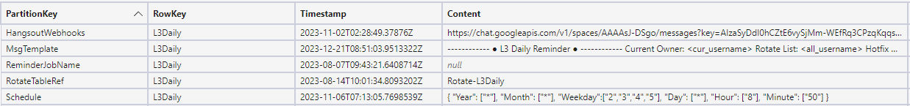
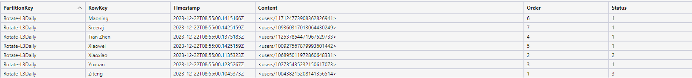
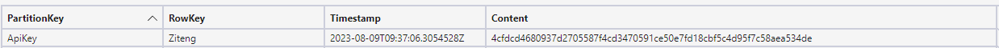

# CAF-Tools

## Introduce
This tool is used to send meeting reminder message in Google Chat regularly.

## How to use
### Preparation
1. Have an `Azure subscription`.
2. `VS Code` and VS Code Extensions `Azure Tools` installed.
3. `Azure Cli` or `Azure Functions Core Tools` installed.
4. `Azure Storage Explorer` installed.

### Deploy Service
1. Create a new `Azure Function App`(will create `Azure Storage Account` as well).
2. Create two Azure Tables in the Azure Storage Account. e.g. `CAFTable`(for Prod env) and `CAFTableLocal`(for Dev env)
3. Change Function App configuration for Prod env, add
   1. `TableUri`: Azure Table url.
   2. `TableName`: Azure Table name.
   3. `TableAccountName`: Azure Storage Account name.
   4. `TableAccountKey`: Azure Storage Account access key.
4. Import dev data(in the `data_bak.zip` file) into Azure Table, change the data(HangsoutWebhook, User ID) by using `Azure Storage Explorer` before test this project.
5. Open local codebase by using VS Code and add a new file `local.settings.json` in the root folder, contents shown below, need change all the 4 fields listed in **Step3**.
    ```json
    {
        "IsEncrypted": false,
        "Values": {
            "AzureWebJobsStorage": "***********************",
            "FUNCTIONS_WORKER_RUNTIME": "dotnet",
            "TableUri": "***********************",
            "TableName": "CAFTableLocal",
            "TableAccountName": "vialtostorage",
            "TableAccountKey": "***********************"
        }
    }
    ```
6. Execute `func start` to run the project in local env. This step , we want to check if this project can be executed successful.
7. If this project can be executed successful, then import prod data into Azure Table, you also need to change the data(HangsoutWebhook, User ID, User status ...).
8. Open VS Code `Azure Tools` extension(Need login to Azure for the first time use), unfold `Function App` list and right click the App you created, click `Deploy to Function App` to deploy.

### Ingest Logs
- Dev env: Logs will be shown in the `command line`.
- Prod env: Logs will be stored in the `Azure Storage Account` you choosed or newly created when create the Function App, if it's newly create one, you can get the Account Name from the field `AzureWebJobsStorage` in the Function App configuration. Log files stored in the `Azure File Share` and under `LogFiles` folder.

### Change table data
| PartitionKey    | Describe                                                                                                                                                                                                                                               | 
| -------- |--------------------------------------------------------------------------------------------------------------------------------------------------------------------------------------------------------------------------------------------------------|
| ApiKey  | Store api access key. <br>**RowKey** is user name, <br>**Content** is the base64 encoded password.                                                                                                                                                     |
| HangsoutWebhooks | Google Chat Webhook for each reminder. <br>**RowKey** is the reminder job name,<br> **Content** is the webhook url.                                                                                                                                    |
| MsgTemplate    | Message template define.   <br>**RowKey** is the reminder job name, <br>**Content** is the template.                                                                                                                                                   |
| ReminderJobName    | Reminder job name.   <br>**RowKey** is the reminder job name, it's looked like a primary key.                                                                                                                                                          |
| RotateTableRef    | The relationship between reminder job and rotate list.  <br>**RowKey** is the reminder job name, <br>**Content** is the rotate list name.                                                                                                              |
| Schedule    | Schedule time define.  <br>**RowKey** is the reminder job name, <br>**Content** is the schedule content, json format, * means all value.                                                                                                               |
| Rotate-xxxx    | Rotate list define, `xxxx` is the reminder job name.  <br>**RowKey** is the rotate user name, <br>**Content** is the rotate user Google Chat ID, <br>**Order**: the order for this user in this rotate list, <br>**Status**: the status for this user. |

### Trigger reminder
#### Automatically
All fields shown in the picture are required.
- For the job setting(First picture), all RowKeys are the same.
- For the rotate list(Second picture), at least 1 rotator is required, and all PartitionKeys are the same.




#### Manually
ApiKey is required.


2 Apis are provided:

| Describe                       | Router        | Method | Param                                                                                                                                 | 
|--------------------------------|---------------|--------|---------------------------------------------------------------------------------------------------------------------------------------|
| Resend current rotate reminder | /api/reminder | GET    | **key**: User real api key(raw value, without base64 encode).  <br>**remindername**: Reminder job name in the table(ReminderJobName). |
| Send next rotate reminder      | /api/reminder | POST   | **key**: User real api key(raw value, without base64 encode).  <br>**remindername**: Reminder job name in the table(ReminderJobName).     |

- Postman scripts template have been provided in the `data_bak.zip` file.
